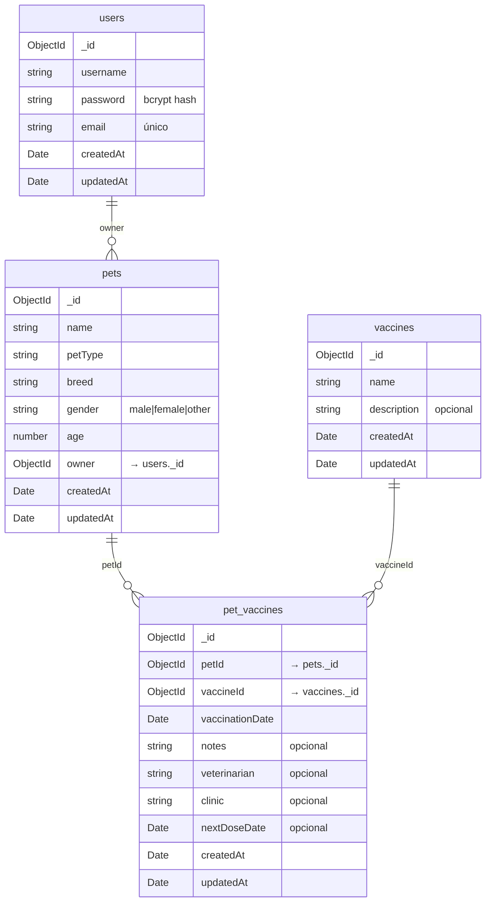
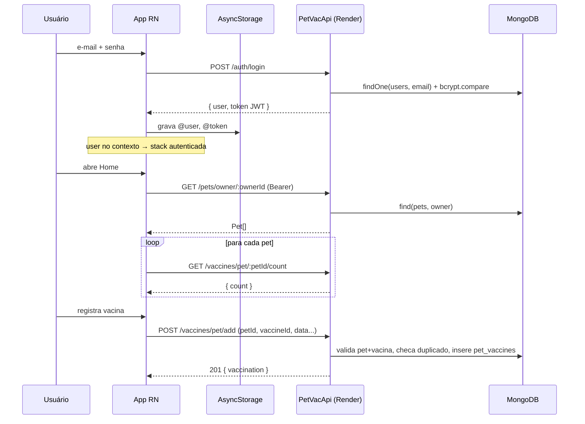

# Relatório de Arquitetura — PetVac (API + App Mobile)

> Documento de retomada dos repositórios `PetVacApi` (backend) e `PetVaccination`
> (mobile). Cobre objetivo, regras de negócio, estrutura, arquitetura e modelagem.
> Data da análise: 2026-09-10.

---

## 1. Visão geral do produto

**PetVac** é uma carteira de vacinação digital para animais de estimação. O tutor
cria uma conta, cadastra seus pets e registra as vacinas aplicadas em cada um,
com data, veterinário, clínica, observações e data da próxima dose. O app mobile
("Diário de Pet") é o cliente; a API é o backend REST que persiste tudo em MongoDB.

| Repositório | Papel | Stack principal |
|---|---|---|
| `PetVacApi` | API REST | Node.js + TypeScript, Fastify 5, TypeORM 0.3 (MongoDB), JWT, Zod |
| `PetVaccination` | App mobile | React Native 0.76 (bare/CLI), React Navigation 7, React Native Paper, Axios |

O app aponta para a API publicada no Render (`https://petvacapi.onrender.com`).

---

## 2. Backend — `PetVacApi`

### 2.1 Objetivo

Expor uma API REST autenticada por JWT para: cadastro/login/edição de usuários,
CRUD de pets por tutor, CRUD de um catálogo global de tipos de vacina, e o
registro do vínculo "pet recebeu vacina X em tal data" com os metadados do evento.

### 2.2 Stack e ferramentas

- **Runtime/linguagem:** Node.js (>=18), TypeScript 5, `reflect-metadata` +
  decorators (`experimentalDecorators`, `emitDecoratorMetadata`).
- **HTTP:** Fastify 5, com `@fastify/jwt` registrado no bootstrap.
- **Persistência:** TypeORM 0.3 com driver `mongodb` 5, tipo de conexão `mongodb`,
  `synchronize: false`, `logging: true`. `MongoRepository` por entidade.
- **Auth:** `jsonwebtoken` para assinar/verificar; `bcrypt` para hash de senha.
- **Validação:** Zod (schemas de entrada por módulo).
- **Build/dev:** `tsup` (bundle CJS em `build/`), `nodemon`/`tsx` em desenvolvimento,
  `prettier` + `.editorconfig`.
- **Presente mas não usado de fato:** `tsyringe` (a injeção de dependência é
  manual — cada controller faz `new XService()`), `@types/express`,
  `@types/mongodb`.

### 2.3 Estrutura de pastas

```
src/
├── app.ts                     # bootstrap Fastify: JWT, DataSource, registro de routers, listen
├── config/
│   └── typeorm.ts             # AppDataSource (mongodb) + lista de entidades
├── Types/
│   └── fastify.d.ts           # augmenta FastifyRequest.user (obs.: não é o campo realmente usado)
├── routes/
│   ├── indexRouter.ts         # GET /healthcheck
│   ├── authRouter.ts          # /auth/register, /auth/login, /auth/users/:userId
│   ├── petRouter.ts           # /pets/*  (preHandler authenticate em tudo)
│   └── vaccineRouter.ts       # /vaccines/*  (preHandler authenticate em tudo)
├── controllers/               # parse com Zod, chamada ao service, montagem da resposta
│   ├── userController.ts
│   ├── petController.ts
│   └── vaccineController.ts
├── services/                  # regra de negócio + acesso a repositório
│   ├── UserService.ts
│   ├── PetService.ts
│   └── VaccineService.ts
├── models/
│   ├── entities/              # entidades TypeORM (decorators)
│   │   ├── User.Entity.ts
│   │   ├── Pet.Entity.ts
│   │   ├── Vaccine.Entity.ts
│   │   └── PetVaccine.Entity.ts
│   ├── schemas/               # schemas Zod (userSchema, petSchema, vaccineSchema)
│   └── dtos/VaccineDto.ts     # arquivo inteiro comentado
├── middleware/
│   ├── authMiddleware.ts      # authenticate(): valida Bearer, popula request.authenticatedUser
│   └── errorMiddleware.ts     # vazio
└── utils/
    └── errorHandler.ts        # AppError + handleError() (Zod / AppError / Error / desconhecido)
```

### 2.4 Arquitetura

Camadas em fluxo linear, sem container de DI:

```
HTTP  →  Router (Fastify plugin, prefix)  →  preHandler: authenticate (JWT)
      →  Controller (Zod.parse + try/catch → handleError)
      →  Service (regra de negócio, validações de existência/unicidade)
      →  MongoRepository (TypeORM)  →  MongoDB Atlas
```

Pontos de arquitetura relevantes:

- **Bootstrap (`app.ts`):** registra `@fastify/jwt` com `JWT_SECRET`; inicializa
  `AppDataSource` de forma assíncrona **sem bloquear** o `listen` (o servidor sobe
  mesmo que o banco falhe); registra routers com prefixos `/auth`, `/pets`,
  `/vaccines` e o `indexRouter` na raiz. Porta = `process.env.PORT` ou `5000`.
- **Autenticação (`authMiddleware.ts`):** lê `Authorization: Bearer <token>`,
  verifica com `jwt.verify` usando `JWT_SECRET` (fallback `"fallback_secret"`),
  e injeta `request.authenticatedUser = { userId: ObjectId }`. Aplicado via
  `fastify.addHook("preHandler", authenticate)` nos routers de pets e vaccines,
  e como `preHandler` pontual no `PUT /auth/users/:userId`.
- **Tratamento de erro:** `handleError(error, reply)` é chamado **manualmente** no
  `catch` de cada handler (não é um error handler global do Fastify). Distingue:
  `ZodError` → 400 com `details[]` (`{field, message}`); `AppError` (classe
  própria com `statusCode` e `errorCode`) → status/código próprios; `Error`
  genérico → **400** com a mensagem; desconhecido → 500.
- **DI manual:** cada controller instancia seu service no topo do módulo
  (`const petService = new PetService()`), e cada service resolve
  `AppDataSource.getMongoRepository(Entity)` no construtor.

### 2.5 Modelagem de dados (MongoDB)

Quatro coleções. `pet_vaccines` é a tabela associativa N:N entre `pets` e
`vaccines`, carregando os dados do evento de vacinação.



Observações de modelagem:

- Relações são **referências manuais por `ObjectId`** — não há `@ManyToOne`/
  `@OneToMany` do TypeORM; os "joins" são feitos no service com múltiplas queries
  (ex.: `findByPet` busca os `pet_vaccines` e depois cada `vaccine` num
  `Promise.all`).
- `vaccines` é um **catálogo global**, não pertence a um usuário. Qualquer usuário
  autenticado pode criar/editar/apagar tipos de vacina.
- `User.Entity` declara `@Unique(["email"])`, mas com `synchronize: false` o índice
  único só existe se tiver sido criado no banco manualmente; a unicidade é
  garantida em código no `UserService.register`/`update`.
- O `vaccineSchema` aceita um campo `pets: string[]` opcional que **não existe** na
  entidade `Vaccine` nem é usado.

### 2.6 Endpoints

| Método | Rota | Auth | Descrição |
|---|---|---|---|
| GET | `/healthcheck` | não | Retorna `"OK"` |
| POST | `/auth/register` | não | Cria usuário (201 com o usuário criado) |
| POST | `/auth/login` | não | Retorna `{ user, token }` |
| PUT | `/auth/users/:userId` | sim | Atualiza o próprio usuário (username/email/senha) |
| POST | `/pets` | sim | Cria pet (`owner` no body) |
| GET | `/pets` | sim | Lista **todos** os pets (sem filtro por dono) |
| GET | `/pets/owner/:ownerId` | sim | Lista pets de um dono |
| GET | `/pets/:id` | sim | Busca pet por id (404 se não existe) |
| PUT | `/pets/:id` | sim | Atualiza pet (campos parciais) |
| DELETE | `/pets/:id` | sim | Apaga pet + suas vacinações (204) |
| POST | `/vaccines` | sim | Cria tipo de vacina |
| GET | `/vaccines` | sim | Lista tipos de vacina |
| GET | `/vaccines/:id` | sim | Busca tipo de vacina |
| PUT | `/vaccines/:id` | sim | Atualiza tipo de vacina |
| DELETE | `/vaccines/:id` | sim | Apaga tipo de vacina + todos os `pet_vaccines` dele (204) |
| GET | `/vaccines/pet/:petId` | sim | Vacinações de um pet: `{ petId, vaccinations[], totalVaccinations }` |
| GET | `/vaccines/pet/:petId/count` | sim | `{ count }` de vacinações do pet |
| POST | `/vaccines/pet/add` | sim | Registra uma vacina em um pet (`petId`, `vaccineId` + metadados no body) |
| GET | `/vaccines/details/:vaccineId/pet/:petId` | sim | `{ vaccine, petVaccine }` |
| DELETE | `/vaccines/pet/:petId/vaccine/:vaccineId` | sim | Remove um registro `pet_vaccine` (204) |

### 2.7 Regras de negócio (backend)

**Usuário**
- Registro: `username` 3–50 chars, só `[a-zA-Z0-9_]`; `email` válido, normalizado
  para minúsculas, **único** (senão `AppError USER_EXISTS` 400); `password` 6–100
  chars e deve conter ao menos um dígito. Senha é gravada como hash bcrypt
  (custo 10).
- Login: compara com bcrypt; credenciais inválidas → `Error("Invalid credentials")`
  (vira 400 no `handleError`). Em sucesso gera JWT `{ userId }` assinado com
  `JWT_SECRET`, expiração `JWT_EXPIRES_IN` ou `"1h"`.
- Update: só o próprio usuário — o controller compara
  `request.authenticatedUser.userId` com o `:userId` da rota e responde **403**
  se diferente. Novo `email` precisa continuar único (`EMAIL_IN_USE` 400). Troca
  de senha exige `currentPassword` correta (senão `INVALID_PASSWORD` 401) e
  `newPassword` com as mesmas regras do registro; o schema Zod ainda exige que
  `currentPassword` esteja presente quando `newPassword` é enviado. A resposta
  remove o campo `password`.

**Pet**
- `name`/`petType`/`breed`: 1–50 chars (trim). `gender`: enum
  `male|female|other`. `age`: inteiro positivo ≤ 50. `owner`: string de 24 hex,
  convertida para `ObjectId` no controller.
- `PUT /pets/:id` valida com `petSchema.partial()` (todos os campos opcionais).
- `DELETE /pets/:id`: **cascata manual** — apaga primeiro todos os `pet_vaccines`
  com aquele `petId`, depois o pet. Retorna 404 se nada foi afetado.
- **Não há verificação de posse**: qualquer usuário autenticado pode ler/editar/
  apagar qualquer pet informando o id (o `owner` não é conferido contra o token).

**Vacina / vacinação**
- Tipo de vacina: `name` 1–50 chars; `description` ≤ 500 opcional.
- `POST /vaccines/pet/add` (`addVaccineToPetSchema` + `VaccineService.addVaccineToPet`):
  - `petId` e `vaccineId` são strings de 24 hex.
  - `vaccinationDate` aceita string ISO ou `Date`; **não pode ser no futuro**.
  - `veterinarian` 4–100 chars (opcional); `clinic` 3–100 chars (opcional);
    `notes` ≤ 1000 (opcional).
  - `nextDoseDate` (opcional): deve ser **no futuro** e **posterior a
    `vaccinationDate`** (`refine`).
  - O service valida que o pet existe (`PET_NOT_FOUND` 404), que o tipo de vacina
    existe (`VACCINE_NOT_FOUND` 404) e que **não há registro duplicado** para o
    par `petId`+`vaccineId` (`VACCINE_ALREADY_REGISTERED` 400) — ou seja, um pet
    só pode ter **um** registro por tipo de vacina.
- `DELETE /vaccines/:id` (tipo): cascata manual — apaga todos os `pet_vaccines`
  daquele `vaccineId` e depois o tipo.
- `getVaccineDetails` / `deletePetVaccine`: validam existência de pet, tipo e do
  registro de vacinação (`VACCINATION_NOT_FOUND` 404).

### 2.8 Configuração e deploy

- Variáveis de ambiente (`.env.example`): `MONGO_URI`, `MONGO_DATABASE`,
  `MONGO_AUTH`, `MONGO_ADMIN`, `MONGO_DATABASE`, `JWT_SECRET`, `JWT_EXPIRES_IN`.
  A porta vem de `PORT` (não listada no exemplo; commits citam "port for render").
- `build`: `tsup src/app.ts --out-dir build --format cjs`; `start`: `node build/app.js`.
- Hospedado no Render — o app mobile usa `https://petvacapi.onrender.com` como
  `baseURL` de produção.

---

## 3. App Mobile — `PetVaccination`

### 3.1 Objetivo

Cliente React Native (projeto *bare*, gerado pelo `@react-native-community/cli`)
para o tutor gerenciar seus pets e a carteira de vacinas de cada um, consumindo a
`PetVacApi`. Identidade visual: Material Design (React Native Paper) com tema
verde (`#2e7d32`), rótulos em português.

### 3.2 Stack

- **Base:** React Native 0.76.1, React 18.3.1, TypeScript, Metro.
- **Navegação:** React Navigation 7 — `@react-navigation/native` +
  `@react-navigation/stack` (createStackNavigator), com `native-stack` também
  instalado e usado nos tipos.
- **UI:** `react-native-paper` 5 (Card, TextInput, Button, Dialog, Modal, Portal,
  FAB, Searchbar, List, Snackbar, ActivityIndicator), `react-native-vector-icons`
  (MaterialCommunityIcons), `react-native-dropdown-select-list`,
  `@react-native-community/datetimepicker`.
- **Rede/estado:** `axios` (instância única com interceptors),
  `@react-native-async-storage/async-storage`, `jwt-decode`.
- **Imagens (feature incompleta):** `react-native-image-picker` + `react-native-fs`
  para salvar fotos localmente.
- **Infra RN:** `react-native-gesture-handler`, `react-native-safe-area-context`,
  `react-native-screens`, `react-native-reanimated` (via masked-view/paper).
- **Testes:** Jest configurado, apenas `__tests__/App.test.tsx` (boilerplate).

### 3.3 Estrutura de pastas

```
index.js                       # registra src/App
App.tsx (raiz)                 # BOILERPLATE do RN — não é usado
src/
├── App.tsx                    # árvore de providers + <Routes/>
├── contexts/
│   └── AuthContext.tsx        # user global, signIn/signOut/register/updateUserContext, global.forceLogout
├── routes/
│   └── index.tsx              # stack condicional (autenticado x não autenticado)
├── screens/
│   ├── Login.tsx
│   ├── Register.tsx
│   ├── HomeScreen.tsx         # lista de pets + busca + paginação + FAB
│   ├── AddPet.tsx
│   ├── PetDetailsScreen.tsx   # dados do pet + lista de vacinas + editar/excluir
│   ├── AddVaccinationScreen.tsx
│   ├── AddVaccineTypeScreen.tsx
│   ├── VaccinationDetailsScreen.tsx
│   └── ProfileScreen.tsx
├── services/
│   ├── api.ts                 # axios instance + interceptors (Bearer, 401 → logout)
│   ├── AuthService.ts         # login/register/updateUser/logout + AsyncStorage + isTokenExpired
│   ├── PetService.ts          # CRUD /pets
│   ├── VaccineService.ts      # CRUD /vaccines + vínculos pet-vacina
│   └── LocalImageService.ts   # RNFS: diretório e cópia de imagens (feature incompleta)
├── hooks/
│   ├── useRequest.ts          # executa async, isLoading, mapeia erros de validação do backend
│   └── useFormValidation.tsx  # validação client-side + Snackbar (uso pontual)
├── components/
│   ├── LoadingOverlay.tsx     # overlay full-screen (Portal + ActivityIndicator)
│   └── ImagePickerComponent.tsx  # importa '../services/ImageService' (caminho inexistente) — não usado
└── types/
    ├── index.ts               # User, Pet, Vaccine, VaccinationRecord, PetVaccine, respostas, petTypes
    ├── navigation.ts          # RootStackParamList + props tipadas por tela
    └── errors.ts              # ValidationError / APIError
```

### 3.4 Arquitetura

```
index.js → src/App.tsx
  SafeAreaProvider
   └ GestureHandlerRootView
      └ PaperProvider (tema verde)
         └ AuthProvider  ── carrega @user/@token do AsyncStorage no boot
            └ Routes
                ├─ user == null  → Login, Register
                └─ user != null  → Home, PetDetails, AddPet, Profile,
                                    AddVaccination, VaccinationDetails, AddVaccineType

Tela → hook useRequest(execute) → Service (axios) → PetVacApi
                         ↑ interceptors: injeta Bearer; em 401 limpa storage + global.forceLogout()
```

- **`AuthContext`** é a única fonte de estado global. No boot, `loadStorageData`
  chama `AuthService.loadAuthData`, que valida a expiração do token com
  `jwt-decode` e, se válido, restaura o header `Authorization` e o `user`.
  `signIn`/`register`/`signOut` delegam ao `AuthService`. O contexto publica
  `global.forceLogout = signOut` para que o interceptor do axios force logout ao
  receber 401.
- **`routes/index.tsx`** decide a stack inteira com base em `user` (não há
  deep-link nem tab navigator); enquanto `loading`, mostra um `ActivityIndicator`.
- **`services/api.ts`**: `baseURL` fixa apontando para produção
  (`https://petvacapi.onrender.com`); a URL local (`http://192.168.18.6:4245`)
  está comentada. Interceptor de request lê `@token` do AsyncStorage (com cache
  em memória) e injeta `Authorization: Bearer`. Interceptor de response: em 401,
  limpa `@token`/`@user` e chama `global.forceLogout`.
- **`useRequest`**: centraliza `isLoading` e a tradução de erros. Se a resposta do
  backend tem `error === 'Validation error'`, mapeia `details[]` para um objeto
  `{ campo: mensagem }` (`errors`); senão popula `generalError` com
  `response.data.error`. As telas exibem `errors.campo` em `HelperText` e
  `generalError` como mensagem geral.
- **Padrão de tela:** componente funcional com `useState` para os campos do form,
  `useRequest` para chamadas, `LoadingOverlay` para o estado de carregamento,
  navegação via `navigation.navigate` / `goBack`. `PetDetailsScreen` e
  `HomeScreen` recarregam dados no evento `focus` da navegação.

### 3.5 Telas e fluxos

| Tela | Função | Chamadas à API |
|---|---|---|
| **Login** | e-mail + senha; sucesso muda `user` no contexto e a stack troca sozinha | `POST /auth/login` |
| **Register** | apelido + e-mail + senha; ao concluir volta para Login | `POST /auth/register` |
| **Home** | lista os pets do tutor; para cada pet busca a contagem de vacinas (N+1); busca por nome e paginação **client-side** (6/página); `FAB.Group` → "Adicionar Pet" / "Adicionar tipo de vacina"; avatar no header → Profile | `GET /pets/owner/:ownerId`, `GET /vaccines/pet/:petId/count` (por pet) |
| **AddPet** | nome; tipo (Dog/Cat/Bird/Other, rótulos PT); raça (lista **fixa hardcoded** por tipo, ou texto livre se "Other"); gênero; idade. Envia `owner = user._id` | `POST /pets` |
| **PetDetails** | dados do pet + lista de vacinações + total; editar nome/idade via `Modal`; excluir pet via `Dialog`; excluir uma vacinação; navega para AddVaccination e VaccinationDetails | `GET /pets/:id`, `GET /vaccines/pet/:petId`, `PUT /pets/:id`, `DELETE /pets/:id`, `DELETE /vaccines/pet/:petId/vaccine/:vaccineId` |
| **AddVaccination** | seleciona a vacina num `Dialog` **paginado** (5/página) que também permite **excluir o tipo de vacina** ali; veterinário, clínica, data (DateTimePicker, default hoje), próxima dose (opcional), observação | `GET /vaccines`, `POST /vaccines/pet/add`, `DELETE /vaccines/:id` |
| **AddVaccineType** | cria um tipo de vacina global (só o nome) | `POST /vaccines` |
| **VaccinationDetails** | detalhes de uma vacinação (data, próxima dose, veterinário, clínica, observações) | `GET /vaccines/details/:vaccineId/pet/:petId` |
| **Profile** | edita apelido/e-mail (campos de troca de senha estão **comentados**); logout no header | `PUT /auth/users/:userId` |

Detalhe importante do fluxo de vacinação: a lista em `PetDetails` usa
`vaccination.vaccine._id` como `vaccinationId` ao navegar; esse valor é o **id do
tipo de vacina**, e é ele que a `VaccinationDetailsScreen` passa para
`GET /vaccines/details/:vaccineId/pet/:petId`. Funciona porque o par
(pet, tipo de vacina) é único no backend.

### 3.6 Regras de negócio (cliente)

- **Sessão:** token e usuário ficam em `AsyncStorage` (`@token`, `@user`). No
  boot, se o token estiver expirado (`exp` via `jwt-decode`), faz logout. Em
  qualquer 401 durante o uso, o interceptor limpa o storage e força logout.
- **Validação:** o cliente faz apenas checagens mínimas de "campo preenchido" e
  de idade numérica; a validação real (formatos, tamanhos, datas) é do backend, e
  as mensagens voltam por campo via `useRequest`.
- **Cadastro de pet:** as raças são listas fixas no código por tipo de animal; o
  `petType` é enviado já traduzido (ex.: `"Cachorro"`).
- **Escopo dos dados:** a Home filtra pets por `user._id`; tipos de vacina são
  globais e qualquer usuário pode criá-los/excluí-los pela UI.
- **Imagens de pet/perfil:** `LocalImageService` (RNFS) e `ImagePickerComponent`
  preparam o armazenamento local de fotos, mas a feature está **incompleta** — o
  componente importa um caminho inexistente (`../services/ImageService`) e não é
  renderizado em nenhuma tela. Consta como trabalho em andamento no commit
  "preparing profile and pet image".

### 3.7 Modelagem no cliente (`types/index.ts`)

Espelha o backend: `User`, `Pet` (com `owner: string`), `Vaccine`,
`PetVaccine`, e tipos de resposta compostos — `VaccinationRecord`
(`{ vaccine, vaccinationDate, notes?, veterinarian?, clinic?, nextDoseDate? }`),
`PetVaccineResponse` (`{ petId, vaccinations[], totalVaccinations }`),
`VaccinationDetailsResponse` (`{ vaccine, petVaccine }`). Há um mapa `petTypes`
(`Dog→Cachorro`, `Cat→Gato`, `Bird→Pássaro`, `Other→Outro`) usado nos selects.

---

## 4. Como o app e a API se conversam



---

## 5. Mapa rápido dos repositórios

| Precisa mexer em... | Backend | Mobile |
|---|---|---|
| Rotas / contrato HTTP | `src/routes/*`, `src/controllers/*` | `src/services/*` |
| Regra de negócio | `src/services/*` | telas + `hooks/useRequest` |
| Validação de entrada | `src/models/schemas/*` (Zod) | validação leve nas telas |
| Modelo de dados | `src/models/entities/*` + `config/typeorm.ts` | `src/types/index.ts` |
| Autenticação | `src/middleware/authMiddleware.ts`, `UserService` | `contexts/AuthContext`, `services/AuthService`, `services/api.ts` |
| Erros | `src/utils/errorHandler.ts` | `hooks/useRequest`, `types/errors.ts` |
| Navegação | — | `src/routes/index.tsx`, `src/types/navigation.ts` |

---

## 6. Histórico (git)

- **`PetVacApi`** — ~24 commits. Começa como refactor grande ("massive
  refactoring"), adiciona módulos pet e vaccine, passa por uma tentativa de
  Swagger (adicionada e removida), ajustes de `ObjectId`, deploy no Render, e
  termina em contagem de vacinas, `getAllPetsByOwner`, validações e delete de
  vacina. Branch única `main`, working tree limpo.
- **`PetVaccination`** — ~8 commits: setup, "huge changes", erros nos hooks +
  busca na Home, validação de vacinação, preparação de perfil/imagem de pet,
  update de perfil, "last commit".

Ambos estão há ~2 anos sem alterações e sem release/tag.
